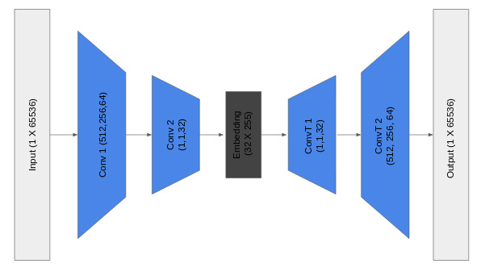
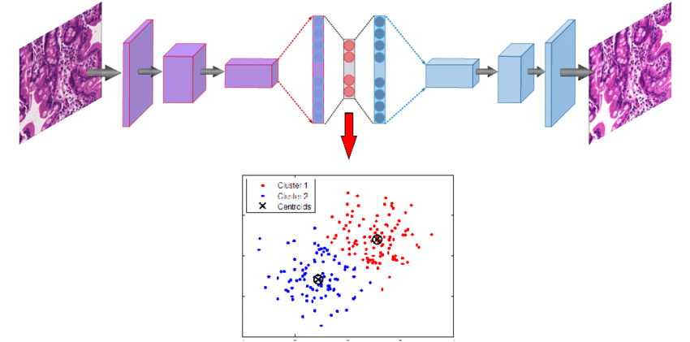

# Introduction

Audio files are notoriously large when uncompressed. For example, CD quality audio, sampled at 44 kHz, has a bitrate of 1,411 kbits per second (kbps). On a 700 MB CD, there is only enough capacity for about an hour of music.

Consequently audio compression is essential to reducing file sizes to more practical levels, enabling efficient storage and transmission. MP3 is the most common *lossy* compression algorithm which uses spectral transforms to harness the sparisity and the perceptual limitation of human hearing.

The MP3 codec typically compresses to a bitrate between 128 kbit/s and 320 kbit/s. This [demo](https://www.youtube.com/watch?v=53tdYmJuUmM) compares audio bitrates of a sample song from 1kbit/s to 320 kbit/s.

Traditional methods of music compression typcially use deterministic algorithms, which rely on identifying features and patterns in the frequency domain. As deep networks excel at capturing complex patterns and extracting nonlinear features, we analyze their ability to condense a song's patterns into a compressed lower-dimensional space. 

Once our compression and extraction framework is in place, we can leverage this compressed space or 'latent space'. The latent space is a more compact version of the audio sample, and is therefore useful when attempting to perform classification. We build another network based on the latent space as opposed to the original input space to perform genre classification. Previous works [3] [4] have used similar methods on the task of genre prediction, using a spectral representation of audio with CNNs and RNNs.

# Dataset

We use the [FMA dataset](https://github.com/mdeff/fma) [5]. This is an open dataset of ~1 TB of songs from many artists and genres. For this project we use the *small* version of the dataset containing 8000 songs from 8 genre categories. We used a 70-30 split between train and test set. The choice to use small version was due to unavailability of computing resources needed for larger versions of the dataset.

# Unsupervised Audio Compression

A deep autoencoder is a special type of feedforward neural network which can be used in denoising and compression [2]. In this architecture, the network consists of an encoder and decoder module. The encoder learns to compress a high-dimensional input X to a low-dimensional latent space z. This "bottleneck" forces the newtork to learn a compression to reduce the information in X to size of Z. The decoder then attempts to faithfully reconstruct the output with minimal error. Both the encoder and decoder are implemented as convolutional neural networks.

Clearly, it is impossible to reconstruct the input with zero error, so the network learns a lossy compression. The network can discover patterns in the input to reduce the data dimensionality required to fit through the bottleneck. The network is penalized with an L2 reconstruction loss. This is a completely unsupervised method of training that provides very rich supervision.

*Autoencoder network structure. Image credit to [Lilian Weng](https://lilianweng.github.io/lil-log/2018/08/12/from-autoencoder-to-beta-vae.html)*

## Frequency domain autoencoder

There are several choices of input space which are critical to achieving good performance. In keeping with other similar approaches [1], we convert the audio signal into a spectrogram using a short-time-fourier-transform (STFT). This converts the song into an "image", with time on one axis and frequency on another. This has advantages in that it is more human-interpretable, and a broad family of techniques from computer vision can be used, as this is thought of as a 2D image.

### Model details

TODO: add

### Loss function

TODO: merge with next section

### Compression Evaluation Metric

Music is fundamentally subjective. Thus generating a quantitatively evaluation metric for our compression algorithm is very difficult. It is not possible to naively compare the reconstructed time domain signals, as completely different signals can sound the same. For example, phase shift, or small uniform frequency shifts are imperceptible to the human ear. A naive loss in the time domain would heavily penalise this.

On the other hand, a time domain loss does not adequately capture high frequencies and low volumes. As human perception of sound is logarithmic, and low frequencies typically have higher amplitude, a time domain loss under-weights high frequencies and results in a muffled, underwater-sounding output.

We follow the approach of [1] and instead use an RMSE metric by directly comparing the frequency spectra across time. This has the benefit of considering low amplitudes and high frequencies, and is perceptually much closer.

TODO: maybe move the spectrograms to results? Use the notebook visualizations.ipynb for labels and stuff

**Original Spectrogram**

**Reconstructed Spectrogram**

We then use a simple RMSE metric to compare the reference and reconstruction

## Time domain autoencoder

Our main motivation for this approach is to build an end-to-end network so that it can potentially learn a more compressed representation. This approach is inspired from computer vision where people moved from a classical pipeline of feature design to end-to-end deep models.

Learning on a time domain signal saves space too as the spectral domain of an audio signal is sparse. We can directly go to a more efficient representation right after the first layer.

### Model details

### Loss functions
Even though an RMSE loss in the time domain is not the best choice from a point of view of audio perception, we found that it worked better than loss computation in spectral or log-spectral domain.

Some of the loss functions we tried:

* RMSE between STFT(input) and STFT(output)
* RMSE + variational loss in the time domain to prevent high frequency noise
* L1 loss in the time domain (to encourage sparse differences and hence exact reconstruction)

# Music Genre Classification

 In this we attempt to utilize the latent features extracted from the music using the autoencoders to classify the music into genres using a supervised approach. This is similar to the clustering approach proposed by Xie et al.[6]. We took the latent space obtained from time-domain compression model and added more CNNs and FC layers on top of it to perform genre classification on 8 classes. The latent features for each song is considered as input features for the genre classifier. We think latent features would perform better than directly using the songs as the latent space can encode the complexity and temporal patterns in the song in a compressed format. The output data is obtained from the same dataset.

*Autoencoder Clustering Representation. Image credit to [K Kowsari](https://bit.ly/2Qu4Kje)*

### Model details

### Loss function

We use a cross entropy loss function, which is a standard practice in classification problems.

# Results

## Compression using frequency domain autoencoder

TODO: add compression ratios too for easier understanding

| Latent Vector Size | Bitrate (kbps) | RMSE | Demo File |
| ------------- |:-------------:| :-----:| --------:|
| 512x1x126 | 126 | 0.867 | [Audio Sample](512.wav) |
| 256x1x126 | 63 | 0.803 | [Audio Sample](256.wav) |
| 128x1x126 | 31.5 | 0.929 | [Audio Sample](128.wav) |
| 64x1x126 | 15.7 | 1.24 | [Audio Sample](64.wav) |
| 32x1x126 | 7.9 | 1.61 | [Audio Sample](32.wav) |

## Compression using time-domain autoencoder

Our model performs 8x compression for audio samples.

**Latent space**
Samples from the test set:

|  |   |
| -- | -- |
|  |   |

Overall space for the test set:

## Audio samples

**Sample 1**

* [Audio input](results/time_autoencoder/compression/sample0/0_input.mp3)
* [Audio output](results/time_autoencoder/compression/sample0/0_output.mp3)

**Sample 2**

* [Audio input](results/time_autoencoder/compression/sample1/4_input.mp3)
* [Audio output](results/time_autoencoder/compression/sample1/4_output.mp3)

## Genre classification

* Overall accuracy on test set: 45%

  * Using majority voting on five 2-second segments of the song
  * 42% percent using just a single 2-second segment

  

   

## Dimensionality reduction for analysis of latent space

In this we tried to apply clustering algorithms on top of our feature space to visualize the latent space generated and see if there is any correlation that can be seen in a 2 dimensional space. We applied PCA, KernelPCA (with kernels rbf, poly, sigmoid and cosine), SparsePCA, LDA and TSNE on the latent features with 2 components in each. Unfortunately, we weren't able to achieve any satisfactory results and most of the genres show overlap with no discernible boundaries.

Below is the 2-dimensional space using KernelPCA with Radial Basis Function as kernel:

 

# Discussion and Conclusions

TODO: add frequency domain conclusions

The time domain autoencoder model can capture the basic rhythm in the music, but it has a lot of white noise in the reconstruction. This is due to the fact that there is no *smoothing* component in the loss function. We tried to penalise difference in the neighbourhood but it did not perform well. We can hear the main beats in the reconstruction but it has a lot of noise.

The classifier performs decent on top of the latent space, which supports the fact latent space represents some identifiable characteristics of music. 

We trained all our models on 2 second snippets of 8000 songs. This choice was driven by the availability of computational resources and schedule for the deliverable. Our model takes ~6 hours to train on Google's Colab platform. We think that having a bigger dataset and increasing the model complexity will improve both compression and genre classification performance.

# Citations

- [1] Roche, Fanny, et al. "Autoencoders for music sound modeling: a comparison of linear, shallow, deep, recurrent and variational models." arXiv preprint arXiv:1806.04096 (2018).
- [2] Vincent, Pascal, et al. "Extracting and composing robust features with denoising autoencoders." Proceedings of the 25th international conference on Machine learning. ACM, 2008.
- [3] Liu, Caifeng, et al. "Bottom-up Broadcast Neural Network For Music Genre Classification." arXiv preprint arXiv:1901.08928 (2019)
- [4] Freitag, Michael, et al. "audeep: Unsupervised learning of representations from audio with deep recurrent neural networks." *The Journal of Machine Learning Research* 18.1 (2017): 6340-6344.
- [5] Defferrard, Michaël, et al. "Fma: A dataset for music analysis." arXiv preprint arXiv:1612.01840 (2016).
- [6] Xie, Junyuan, Ross Girshick, and Ali Farhadi. "Unsupervised deep embedding for clustering analysis." International conference on machine learning. 2016.
