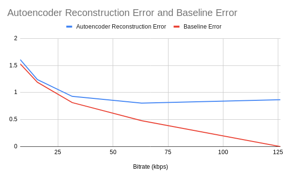
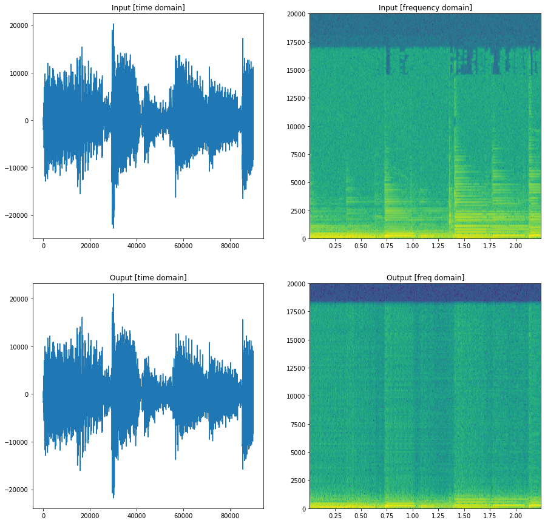

# Deep Autoencoders for Music Compression and Classification

# Introduction (Sherry)

What is music compression? What are some common bitrates, find a few audio samples at different bitrates. What are the traditional methods for music compression

What is a STFT, what is a song spectrogram

# Approach

## Unsupervised Audio Compression

A deep autoencoder is a special type of feedforward neural network which can be used in denoising and compression [2]. In this architecture, the network consists of an encoder and decoder module. The encoder learns to compress a high-dimensional input X to a low-dimensional latent space z. This "bottleneck" forces the information in X to be compressed. The decoder then attempts to faithfully reconstruct the output with minimal error. Both the encoder and decoder are implemented as convolutional neural networks.

Clearly, it is impossible to reconstruct the input with zero error, so the network learns a lossy compression. The network can discover patterns in the input to reduce the data dimensionality required to fit through the bottleneck. The network is penalized with an L2 reconstruction loss. This is a completely unsupervised method of training that provides very rich supervision.

There are several choices of input space which are critical to achieving good performance. In keeping with other similar approaches [1], we convert the audio signal into a spectrogram using a short-time-fourier-transform (STFT). This converts the song into an "image", with time on one axis and frequency on another. This has advantages in that it is more human-interpretable, and a broad family of techniques from computer vision can be used, as this is thought of as a 2D image.

### Compression Evaluation Metric

Music is fundamentally subjective. Thus generating a quantitatively evaluation metric for our compression algorithm is very difficult. It is not possible to naively compare the reconstruced time domain signals, as completely different signals can sound the same. For example, phase shift, or small uniform frequency shifts are imperceptible to the human ear. A naive loss in the time domain would heavily penalize this.

On the other hand, a time domain loss does not adequately capture high frequencies and low volumes. As human perception of sound is logarithmic, and low frequencies typically have higher amplitude, a time domain loss under-weights high frequencies and results in a muffled, underwater-sounding output.

We follow the approach of [1] and instead use an RMSE metric by directly comparing the frequency spectra across time. This has the benefit of considering low amplitudes and high frequencies, and is perceptually much closer.

Original Spectrogram

Reconstructed Spectrogram

We then use a simple RMSE metric to compare the reference and reconstruction

### Music Genre Classification

Signal autoencoder, attempt to learn fourier 

Supervised training for classification

# Dataset

# Results

| Latent Vector Size | Bitrate (kbps) | RMSE | Demo File |
| ------------- |:-------------:| :-----:| --------:|
| 512x1x126 | 126 | 0.867 | [Audio Sample](512.wav) |
| 256x1x126 | 63 | 0.803 | [Audio Sample](256.wav) |
| 128x1x126 | 31.5 | 0.929 | [Audio Sample](128.wav) |
| 64x1x126 | 15.7 | 1.24 | [Audio Sample](64.wav) |
| 32x1x126 | 7.9 | 1.61 | [Audio Sample](32.wav) |

**Latent space**
Samples from the test set:

|  |   |
| -- | -- |
|  |   |

Overall space for the test set:

## Audio samples

**Sample 1**

**Sample 2**

## Genre classification

* Overall accuracy on test set: 45%

  * Using majority voting on 5 2-second segments of the song
  * 42% percent using just a single 2 second segment

  

   

- Audio samples from compression
- Compression results
- Loss curves during training

# Discussion and Conclusions

# Citations

- [1] Roche, Fanny, et al. "Autoencoders for music sound modeling: a comparison of linear, shallow, deep, recurrent and variational models." arXiv preprint arXiv:1806.04096 (2018).

- [2] Vincent, Pascal, et al. "Extracting and composing robust features with denoising autoencoders." Proceedings of the 25th international conference on Machine learning. ACM, 2008.
